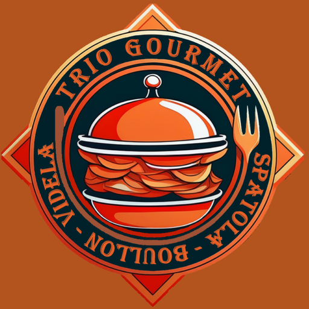
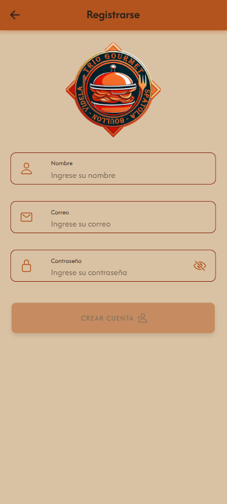
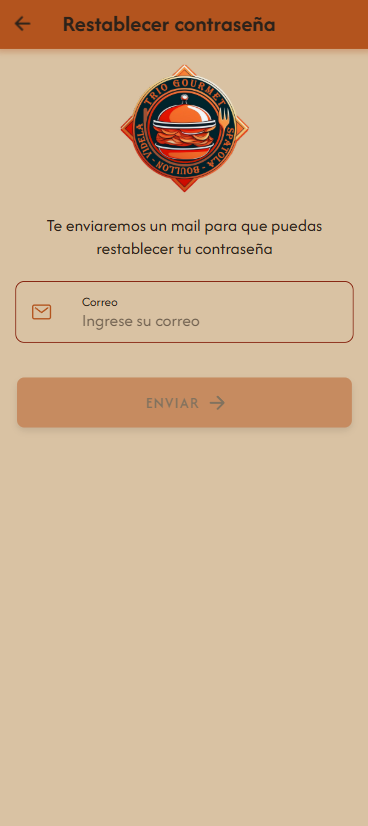
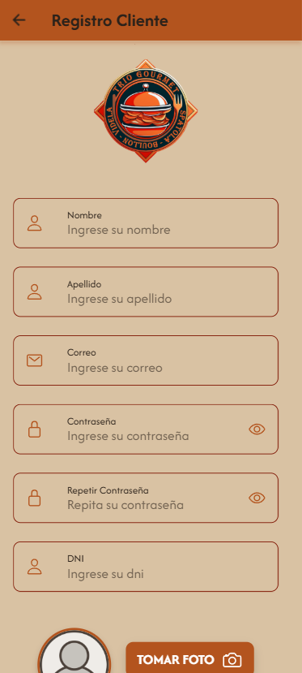
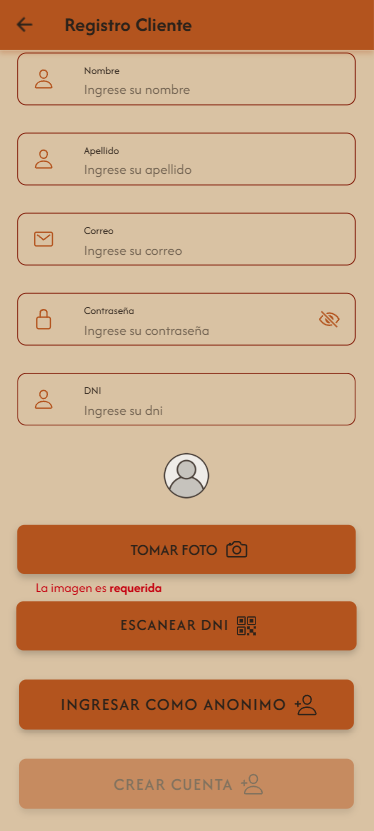
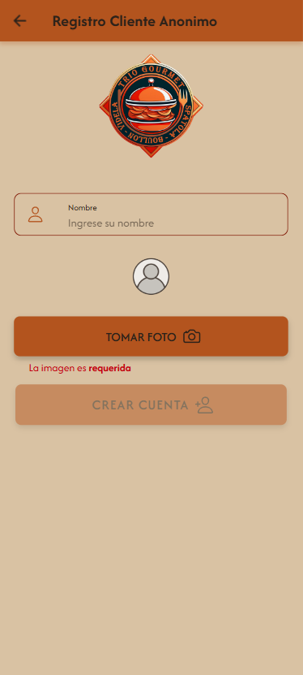
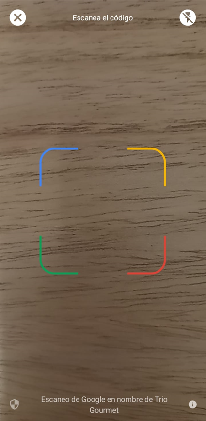

# Trio Gourmet  
Integrantes
* Mateo Spatola
* Nicolás Carlos Boullon
* Iván Agustín Videla Ribodino

Materia
* Practica Profesional 4A
* Division A141-2

Profesores
* Maximiliano Neiner
* Alejandro Constanzo

Listado preliminar  
Iván Agustín Videla Ribodino:
* Alta dueño/supervisor
* Alta mesa
* QR de la mesa
* Encuesta empleados
* Ingresar al local
* Generar reservas agendadas
* Push notificacion de: Consultar al mozo, generar reservas agendadas/delivery.
* Juego para obtener un 10% de descuento

Nicolas Carlos Boullon:
* Alta empleados
* Alta productos
* QR de la propina
* Encuesta supervisor
* Realizar pedidos (platos y bebidas)
* Push notificacion de: Agregar cliente nuevo, confirmar pedido (por parte del mozo)
* Realizar pedido con GPS o direccion
* Juego para obtener un 15% de descuento

Mateo Spatola:
* Alta clientes
* QR de ingreso al local
* Encuesta clientes
* Agregar un nuevo cliente registrado
* Confirmar pedidos
* Push notificacion de: Ingreso al local, confirmar realizacion del pedido (por parte del cocinero o bartender)
* Mapa de ruta hasta el domicilio de entrega
* Juego para obtener un 20% de descuento

## Aplicacion

### Logo

### Inicio de Sesión

### Creacion de Cuenta

### Recupero de contraseña

### Registro Cliente actualizado

 

### Registro Cliente Anonimo

### Escaneo de QR

