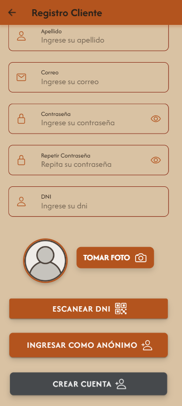
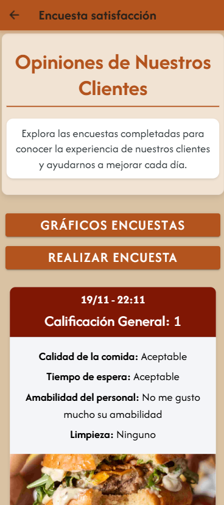

# Trío Gourmet  

## Integrantes  
* Mateo Spatola  
* Nicolás Carlos Boullon  
* Iván Agustín Videla Ribodino  

## Materia  
* Práctica Profesional 4A  
* División A141-2  

## Profesores  
* Maximiliano Neiner  
* Alejandro Constanzo  

## Listado preliminar  

### Iván Agustín Videla Ribodino:  
* Alta dueño/supervisor.  
* Alta mesa.  
* QR de la mesa.  
* Encuesta empleados.  
* Ingresar al local.  
* Generar reservas agendadas.  
* Push notificación de:  
  - Consultar al mozo.  
  - Generar reservas agendadas/delivery.  
* Juego para obtener un 10% de descuento.  

### Nicolás Carlos Boullon:  
* Alta empleados.  
* Alta productos.  
* QR de la propina.  
* Encuesta supervisor.  
* Realizar pedidos (platos y bebidas).  
* Push notificación de:  
  - Agregar cliente nuevo.  
  - Confirmar pedido (por parte del mozo).  
* Realizar pedido con GPS o dirección.  
* Juego para obtener un 15% de descuento.  

### Mateo Spatola:  
* Alta clientes.  
* QR de ingreso al local.  
* Encuesta clientes.  
* Agregar un nuevo cliente registrado.  
* Confirmar pedidos.  
* Push notificación de:  
  - Ingreso al local.  
  - Confirmar realización del pedido (por parte del cocinero o bartender).  
* Mapa de ruta hasta el domicilio de entrega.  
* Juego para obtener un 20% de descuento.  

---
## **Tareas Realizadas**
## **Iván Agustín Videla Ribodino**  
- **Branch trabajada**: videla   
- **Splash estático**: Ícono, spinner y vibración.  
- **Creación de cliente nuevo**: Mediante escaneo de DNI.  
- **Notificaciones push**.  (Con Mateo Spatola)
- **Encuestas**:  
  - Verificar que solo pueda acceder a los resultados de las encuestas previas realizadas.
  - El cliente, escaneando el QR de su mesa, podrá visualizar los resultados de las encuestas
en distintos tipos de gráficos (torta, barra, lineal, etc.).
- **Productos**:  
  - Carga de código QR para ver un listado que incluye:  
    - Imágenes.  
    - Precio.  
    - Descripción.  
    - Tiempo estimado de entrega.  
- **Mesa asignada**:  
  - Se muestra un botón de _"Consulta al mozo"_ con:  
    - Número de mesa.  
    - Fecha, hora y minutos.  
    - Consulta realizada.  
  - Verificar que la consulta llegue correctamente.  
- **Pedido**:
  - Cliente realiza un pedido.
  - Verificar que en todo momento se muestre:
    - Importe total.
    - Tiempo estimado del pedido.
  - Verificar que el pedido no sea derivado a sus respectivos sectores hasta que el mozo no confirme el pedido.
- **Juego**:
  - Implementar el juego.
---

## **Mateo Spatola**  
- **Branch trabajada**: spatola   
- **Splash dinámico**.
- **Inicio de sesión y registro**:  
  - Registro básico.  
  - Recuperación de contraseña.  
- **Mensajes personalizados**:  
  - Logo de la empresa.  
  - Fuentes distintas.  
- **Correo electrónico automático** (Iván Agustín Videla Ribodino).  
- **Verificación de clientes**:  
  - Verificar que el cliente **NO pueda ingresar** a la aplicación si no es aceptado.  
  - Informar con un mensaje alusivo.  
- **API y deploy**:  
  - Creación de API y deploy en Render (Iván Agustín Videla Ribodino).  
- **Acceso anónimo mediante QR**:  
  - Solicitar mesa.  
  - Verificar que el cliente aparezca en la lista del maitre (con notificaciones push).  
  - Verificar que el cliente no pueda tomar una mesa sin estar en la lista de espera.  
- **Asignación de mesas**:  
  - Maitre asigna la mesa al cliente.  
  - Verificar que el cliente **NO pueda vincularse a otra mesa**, indicando que ya tiene una asignada.  
  - Escaneo del QR de la mesa asignada:  
    - Verificar que la mesa no pueda ser asignada a otro cliente.  
- **Estado del pedido**:
  - El cliente vuelve a escanear el código QR de la mesa y podrá acceder al estado de su pedido.
  - El cliente verifica el cambio de estado en su pedido (escaneando el QR de su mesa).
  - El cliente confirma la recepción de su pedido.
- **Accesos adicionales**:
  - El cliente vuelve a escanear el código QR de la mesa y podrá acceder a los juegos*, a la encuesta y al estado de su pedido.
  - El cliente vuelve a escanear el código QR de la mesa y podrá acceder a los juegos*, a la encuesta y a la opción de ‘pedir la cuenta’.
- **Pagos**:
  - El cliente solicita la cuenta al mozo (notificación push).
  - Se habilita, mediante la lectura del código QR correspondiente, el ingreso de la propina.
  - El mozo confirma el pago y se libera la mesa.
- **Botones de ingreso rápido** (Con Nicolás Carlos Boullon).
- **Eliminación de clientes**:
  - Botón para eliminar a un cliente de la lista de espera.
- **Sonidos**:
  - Sonidos distintos al iniciar y cerrar la aplicación.
---

## **Nicolás Carlos Boullon**  
- **Branch trabajada**: boullon    
- **Repositorio GitHub**:  
  - Creación de repositorio completo con colaboradores.  
- **Alta de cliente anónimo**.  (Con Mateo Spatola)
- **Validación de formularios**:  
  - Formatos.  
  - Campos vacíos.  
  - Tipos de datos correctos.  
- **Pre-registro de clientes**:  
  - Verificar que el pre-registro se visualice en la lista de clientes pendientes de aprobación por el dueño o supervisor.  
  - Verificar que un cliente no pueda ingresar sin ser aprobado.  
  - Informar al cliente con un mensaje alusivo.  
- **Aprobación de clientes**:  
  - Dueño o supervisor acepta o rechaza al cliente.  
  - Verificar que, al ser aceptado, el cliente pueda ingresar.  
- **Gestión de pedidos**:  
  - Mozo confirma el pedido y lo deriva a los sectores correspondientes.  
  - Verificar que las distintas partes del pedido se visualicen en los sectores respectivos (notificaciones push).  
- **Sectores (Cocina y Bar)**:  
  - Realizan las tareas correspondientes y notifican que los productos están listos para el mozo.  
  - Cada sector ve únicamente sus propias comandas.  
- **Pedidos pendientes**:  
  - Verificar que el mozo pueda visualizar las partes del pedido pendientes en su lista.  
- **Entrega de pedidos**:  
  - El mozo entrega el pedido completo, incluyendo:  
    - Comidas.  
    - Bebidas.  
    - Postres.  
- **Pagos**:
  - El detalle de la cuenta tendrá:
    - Los pedidos realizados (con precios unitarios) con su respectivo importe.
    - Los descuentos correspondientes a los juegos* (sólo si gana en el primer intento).
    - El grado de satisfacción del cliente (propina).
    - El **TOTAL** a abonar (grande y claro).
  - El cliente tendrá la posibilidad de realizar el pago (simulado) mediante una plataforma de pagos.
 
  
## Aplicacion

### Logo

### QR solicitar mesa

### QR Mesa Uno

### QR Mesa Dos

### QR Mesa Tres

### QR Propina

### Inicio de Sesión

### Recupero de contraseña

### Registro Cliente actualizado

 

### Registro Cliente Anónimo

### Escaneo de QR

### El cliente accede a las encuestas

### Aceptar Cliente

### Asignar Mesa

### Cliente antes de acceder a la lista de espera

### Cliente en lista de espera   

### Menú del Cliente con Mesa Asignada

### Usuario accede a realizar pedido.

### Si el usuario quiere ver el pedido puede acceder al "Ver Pedido".

### El mozo tendra un menú para gestionar las mesas.

### Acá el Mozo deberá aceptar el pedido o rechazarlo.

### De ser aceptado, cada sector recibirá una notificación con sus productos correspondientes.   

* Cocina   

* Barra   

### El Mozo accedera a ver los pedidos que ya esten listos para servir.    
* Pedido listo para servir.   

### Luego de llevar a la mesa, el cliente confirmará la recepción del pedido.

### Desde aqui podremos escanear el QR de las propinas y seleccionar la propina según el cliente quiera.

   

### Una vez confirmado el pedido, escaneando el QR se accederá a un menú con distintas opciones, solicitar mesa, juegos y encuesta.   

   

### Juego
Si se logra ganar el juego, se obtendrá un 10% de descuento.   
   

### Encuesta

### Estadísticas de Encuestas

### Cuenta

### Pagar Cuenta

