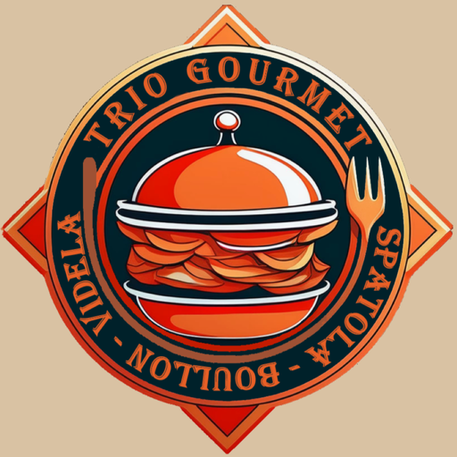
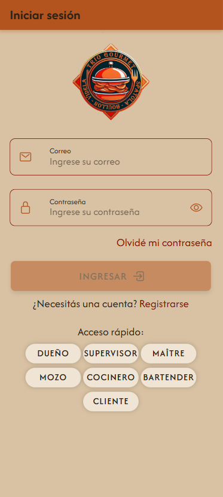
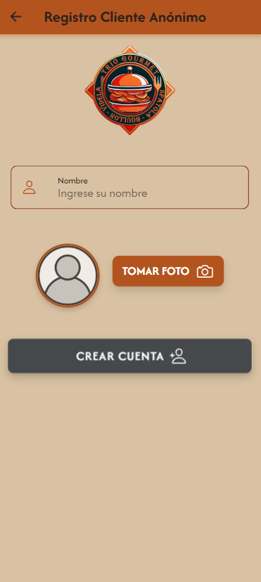
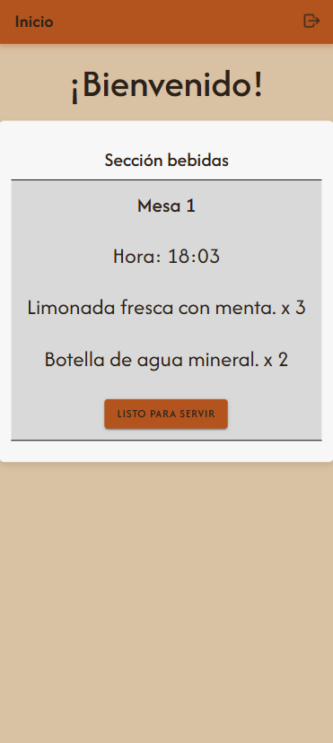

# Trio Gourmet  
Integrantes
* Mateo Spatola
* Nicolás Carlos Boullon
* Iván Agustín Videla Ribodino

Materia
* Práctica Profesional 4A
* División A141-2

Profesores
* Maximiliano Neiner
* Alejandro Constanzo

Listado preliminar  
Iván Agustín Videla Ribodino:
* Alta dueño/supervisor
* Alta mesa
* QR de la mesa
* Encuesta empleados
* Ingresar al local
* Generar reservas agendadas
* Push notificación de: Consultar al mozo, generar reservas agendadas/delivery.
* Juego para obtener un 10% de descuento

Nicolas Carlos Boullon:
* Alta empleados
* Alta productos
* QR de la propina
* Encuesta supervisor
* Realizar pedidos (platos y bebidas)
* Push notificación de: Agregar cliente nuevo, confirmar pedido (por parte del mozo)
* Realizar pedido con GPS o dirección
* Juego para obtener un 15% de descuento

Mateo Spatola:
* Alta clientes
* QR de ingreso al local
* Encuesta clientes
* Agregar un nuevo cliente registrado
* Confirmar pedidos
* Push notificación de: Ingreso al local, confirmar realización del pedido (por parte del cocinero o bartender)
* Mapa de ruta hasta el domicilio de entrega
* Juego para obtener un 20% de descuento

## Aplicacion

### Logo

### Inicio de Sesión

### Recupero de contraseña

### Registro Cliente actualizado

 

### Registro Cliente Anónimo

### Escaneo de QR

### Aceptar Cliente

### Lista Clientes no aprobados

### Menú del Cliente con Mesa Asignada

### Usuario accede a realizar pedido

### Si el usuario quiere ver el pedido puede acceder al "Ver Pedido"

### Una vez realizado el pedido se le dara el aviso

### Luego de esto el Mozo deberá aceptar el pedido o rechazarlo

### De ser aceptado, cada sector recibirá una notificación con sus productos correspondientes.   

* Cocina   

* Barra   

### El Mozo accedera a ver los pedidos que ya esten listos para servir. Cada sector trabaja de forma independiente, significa que si el sector bebidas ya tiene preparado su pedido podria llevare a la mesa sin esperar al otro sector.    
* Primero bebida y luego comida      

* En el caso de estar listo las dos cosas juntas se veria asi.   

